# Influx DB Analysyis, Query documentation and performance benchmarks

First released in 2013, InfluxDB is the market leader in the TSDB space, overtaking Graphite and OpenTSDB that came before. As with many OSS database companies, InfluxDB is licensed with MIT License for a single node, with paid plans available for InfluxDB Cloud and InfluxDB enterprise that provide clustering and other production-ready features.

Before the InfluxDB 2. x release in 2019, the InfluxDB Platform consisted of the TICK stack: Telegraf (agent for collecting and reporting metrics), InfluxDB, Chronograf (interface to query data from InfluxDB), and Kapacitor (real-time streaming data processing engine). As seen in the diagram below, InfluxDB 1. x primarily focused on time-series data from servers and web applications. Before Prometheus came along to take market share in this space, InfluxDB had the most significant community and integrations to collect, store, and view application metrics.

**Data model (tagset model)**: Besides the timestamp field, each data element consists of various tags (optional, indexed metadata fields), fields (key and value), and measurement (container for tags, fields, and timestamps). The example below takes census data from bees and ants, collected in Klamath and Portland by scientists Anderson and Mullen. Here location and scientist are tags, falling under the census measurement with field/value pair for bees and ants.

**Data schema (TSM & TSI):** are data elements stored in time-structured merge tree (TSM) and time series index (TSI) files. TSM can be thought of as an LSM tree with a write-ahead log (WAL) and read-only files similar to SSTables that are sorted and compressed. TSI is an index on files on disk that InfluxDB memory maps to take advantage of the Least Recently Used (LRU) memory of the operating system to help with datasets with high cardinality (i.e., large elements in a set).

**Flux scripting language:** a domain-specific language developed by InfluxDB to help with querying data. Flux has an SQL package to help query from SQL data sources as well.

Most notably, InfluxDB does not enforce a schema before ingesting data. Instead, the schema is automatically created from the input data, inferred from the tags and fields. This NoSQL-like experience is both InfluxDB's strength and weakness. For datasets with relatively low cardinality that naturally fit this tagset model (e.g., most infrastructure and application metrics, some IoT data, some financial data), InfluxDB is extremely easy to get started without worrying about designing schemas or indexes. It also shines in use cases where the goal is to create digital models of physical assets. For example, in IoT, one may need to create a digital twin to represent a collection of sensors and ingest organized data.

**Features**

- No-SQL-like experience with the custom query language.
- Continuous query for real-time aggregations
- Schemaless

### Populate Data Set in local
For local set up use docker-compose file to set it up in local machine. The docker file is located in https://github.com/cryptotradev/pricing-engine-adr/tree/main/database/influxDB. Execute following command in the directory.
``` shell  
docker-compose up -d  
```  
After starting up the influxDB UI can be found in http://localhost:8099  
You can use influx cloud version too but had some limitations in terms of data validation for only 30 days.

To populate data we have a go file insert.go, there it populates around data for 1year for 100 products. The process takes few mins 5 to 10 mins to do so.

The data consists of below model
``` go  
type Tick struct {    
  TickedAt  time.Time    
  CreatedAt time.Time    
  Product   string    
  Price     float64 }  
```  

### Analyze Queries in influxDB using flux notation
We first do analysis on whole data set and later explore on the data downsizing and data aggregation using tasks. All the queries were created considering TimescaleDb queries as base line.  
Jmeter bench mark is done for all the use cases with same load 25 concurrent users with 200 loops. Total 5000 requests  
The InfluxDB configuration - Docker with 3 core CPUs, 5 GB of RAM.

### Continous Query is created on daily aggregates.
A task is created to calculate aggregates daily for an year.

``` flux  
option task = {name: "daily_aggregate", every: 1d}    
 max = from(bucket: "local")    
   |> range(start: -1y)    
   |> filter(fn: (r) =>    
      (r["_measurement"] == "ticks"))    
   |> filter(fn: (r) =>    
      (r["_field"] == "price"))    
   |> aggregateWindow(every: 1d, fn: max, createEmpty: false)    
   |> yield(name: "max")    
   |> set(key: "_field", value: "max")    
|> to(bucket: "daily-aggregate", org: "local") min = from(bucket: "local")    
   |> range(start: -1y)    
   |> filter(fn: (r) =>    
      (r["_measurement"] == "ticks"))    
   |> filter(fn: (r) =>    
      (r["_field"] == "price"))    
   |> aggregateWindow(every: 1d, fn: min, createEmpty: false)    
   |> yield(name: "min")    
   |> set(key: "_field", value: "min")    
|> to(bucket: "daily-aggregate", org: "local") first = from(bucket: "local")    
   |> range(start: -1y)    
   |> filter(fn: (r) =>    
      (r["_measurement"] == "ticks"))    
   |> filter(fn: (r) =>    
      (r["_field"] == "price"))    
   |> aggregateWindow(every: 1d, fn: first, createEmpty: false)    
   |> yield(name: "first")    
   |> set(key: "_field", value: "first")    
|> to(bucket: "daily-aggregate", org: "local") last = from(bucket: "local")    
   |> range(start: -1y)    
   |> filter(fn: (r) =>    
      (r["_measurement"] == "ticks"))    
   |> filter(fn: (r) =>    
      (r["_field"] == "price"))    
   |> aggregateWindow(every: 1d, fn: last, createEmpty: false)    
   |> yield(name: "last")    
   |> set(key: "_field", value: "last")    
|> to(bucket: "daily-aggregate", org: "local") mean = from(bucket: "local")    
   |> range(start: -1y)    
   |> filter(fn: (r) =>    
      (r["_measurement"] == "ticks"))    
   |> filter(fn: (r) =>    
      (r["_field"] == "price"))    
   |> aggregateWindow(every: 1d, fn: mean, createEmpty: false)    
   |> yield(name: "mean")    
   |> set(key: "_field", value: "mean")    
|> to(bucket: "daily-aggregate", org: "local") count = from(bucket: "local")    
   |> range(start: -1y)    
   |> filter(fn: (r) =>    
      (r["_measurement"] == "ticks"))    
   |> filter(fn: (r) =>    
      (r["_field"] == "price"))    
   |> aggregateWindow(every: 1d, fn: count, createEmpty: false)    
   |> yield(name: "count")    
   |> set(key: "_field", value: "count")    
   |> to(bucket: "daily-aggregate", org: "local")  
```  

# Local Benchmarks

## Daily High Low Query
1. First using whole dataset with, the query is created. (**With Out Union**)
``` flux  
from(bucket: "local")    
  |> range(start: -1d)    
  |> filter(fn: (r) => r["_measurement"] == "ticks")    
  |> filter(fn: (r) => r["_field"] == "price")    
  |> filter(fn: (r) => r["product"] == "AGUX/USD")    
  |> aggregateWindow(every: 1d, fn: max, createEmpty: false)    
  |> yield(name: "max")    
 from(bucket: "local")    
  |> range(start: -1d)    
  |> filter(fn: (r) => r["_measurement"] == "ticks")    
  |> filter(fn: (r) => r["_field"] == "price")    
  |> filter(fn: (r) => r["product"] == "AEBC/USD")    
  |> aggregateWindow(every: 1d, fn: min, createEmpty: false)    
  |> yield(name: "min")  
```  
#### Jmeter Bench Marking
### 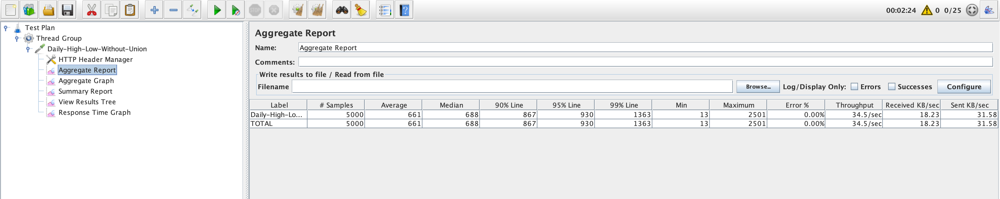

### 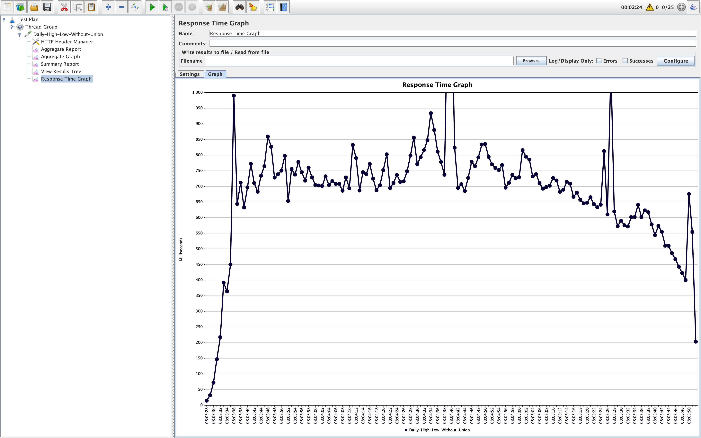

2. Whole dataset with, the query is created. (**With Union**)
``` flux  
data = from(bucket: "local")  
 |> range(start: -1d) |> filter(fn: (r) => r["_measurement"] == "ticks") |> filter(fn: (r) => r["product"] == "AGUX/USD") |> window(every: 1d) max = data  
 |> filter(fn: (r) => r["_field"] == "max")  |> max()   
|> set(key: "type", value: "max" ) min = data  
 |> filter(fn: (r) => r["_field"] == "min")  |> min()   
|> set(key: "type", value: "min" ) union(tables: [min, max])   
  |>  group(columns:["type"], mode: "by")   
  |> yield()  
```  
### 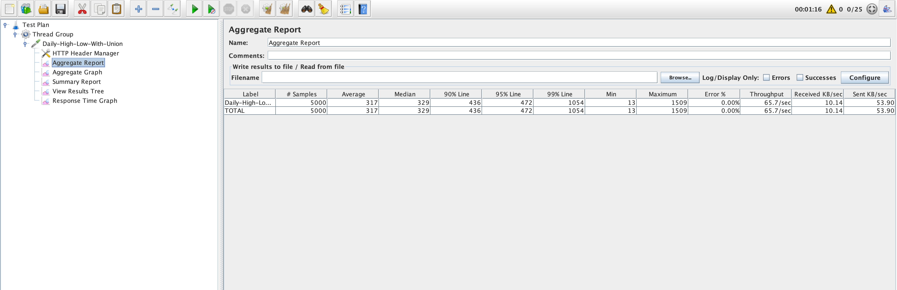

### 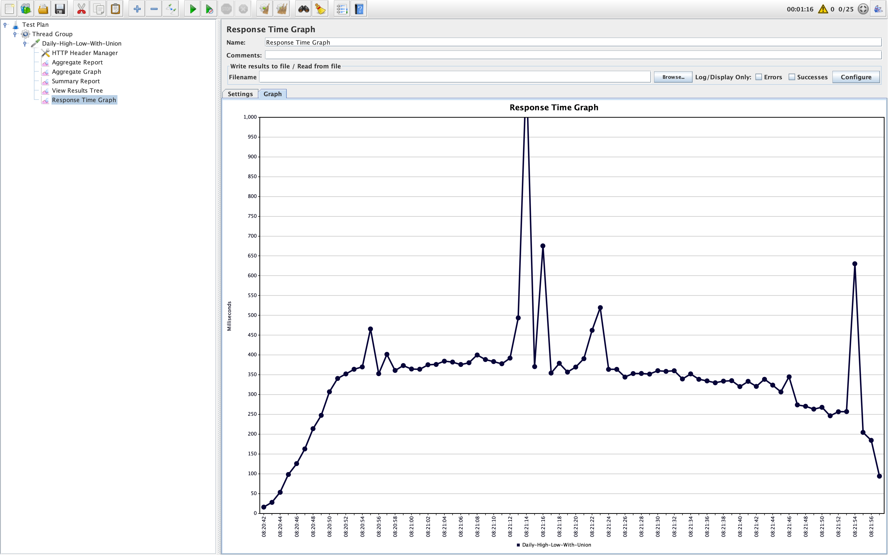

3. Aggregate dataset with, the query is created. (**With Union**)
``` flux  
data = from(bucket: "daily-aggregate")  
 |> range(start: -1d) |> filter(fn: (r) => r["_measurement"] == "ticks") |> filter(fn: (r) => r["product"] == "AGUX/USD") |> window(every: 1d) max = data  
 |> filter(fn: (r) => r["_field"] == "max")  |> max()   
|> set(key: "type", value: "max" ) min = data  
 |> filter(fn: (r) => r["_field"] == "min")  |> min()   
|> set(key: "type", value: "min" ) union(tables: [min, max])   
  |>  group(columns:["type"], mode: "by")   
  |> yield()  
```  
### 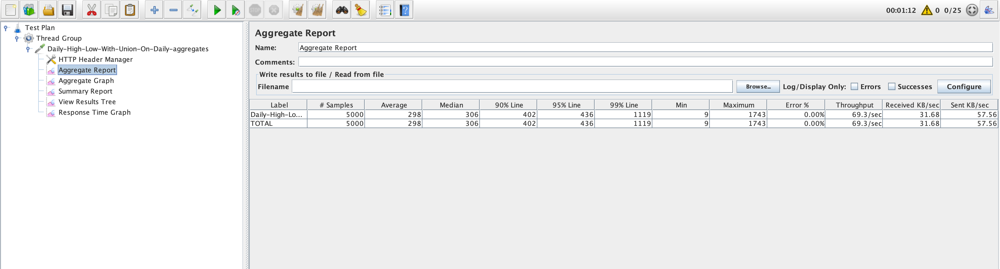

### 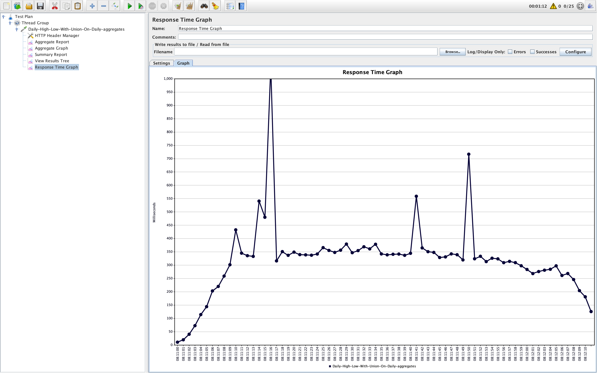

## Customize 7 Day 1Month
1. On Whole Data Set - WIth Union
``` flux  
data = from(bucket: "local")   
  |> range(start: -30d)   
  |> filter(fn: (r) => r["_measurement"] == "ticks")   
  |> filter(fn: (r) => r["_field"] == "price")   
  |> filter(fn: (r) => r["product"] == "AGUX/USD")   
|> window(every: 1w) min = data   
   |> min()   
|> set(key: "type", value: "min" ) max = data   
  |> max()   
|> set(key: "type", value: "max" ) first = data   
  |> first()   
|> set(key: "type", value: "first" ) last = data   
  |> last()   
|> set(key: "type", value: "last" ) union(tables: [min, max, first, last])   
  |> group(columns:["type"], mode: "by")   
  |> yield()  
```  
### 

### 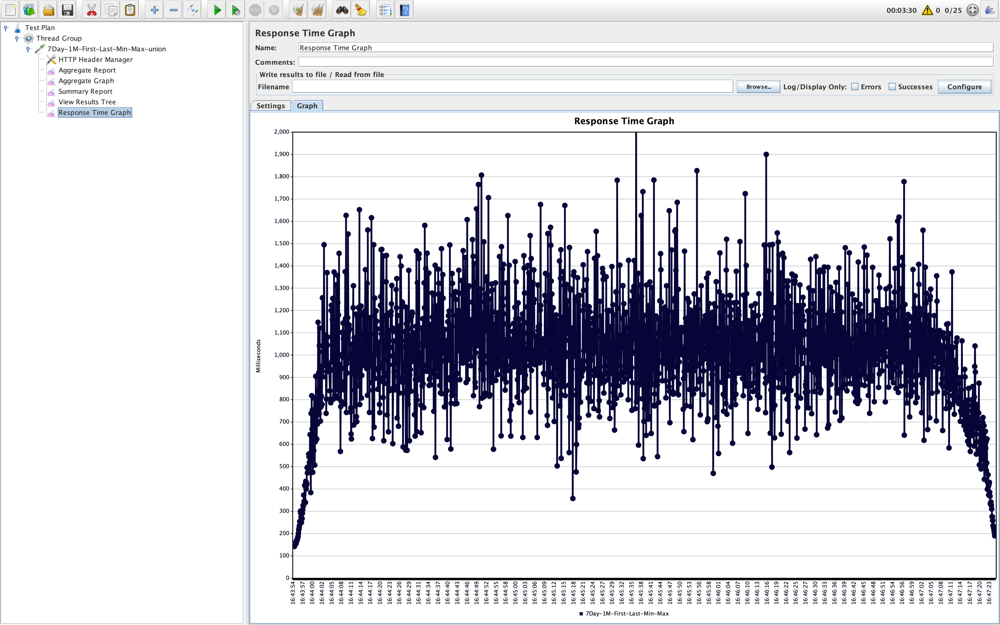

2. On Daily aggregate Data Set - WIth Union
``` flux  
data = from(bucket: "daily-aggregate")   
  |> range(start: -30d)   
  |> filter(fn: (r) => r["_measurement"] == "ticks")   
  |> filter(fn: (r) => r["_field"] == "price")   
  |> filter(fn: (r) => r["product"] == "AGUX/USD")   
|> window(every: 1w) min = data   
   |> min()   
|> set(key: "type", value: "min" ) max = data   
  |> max()   
|> set(key: "type", value: "max" ) first = data   
  |> first()   
|> set(key: "type", value: "first" ) last = data   
  |> last()   
|> set(key: "type", value: "last" ) union(tables: [min, max, first, last])   
  |> group(columns:["type"], mode: "by")   
  |> yield()  
```  
### 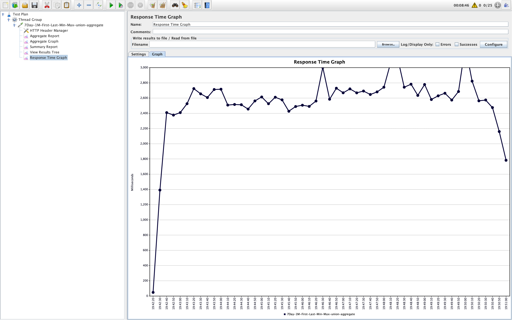

### 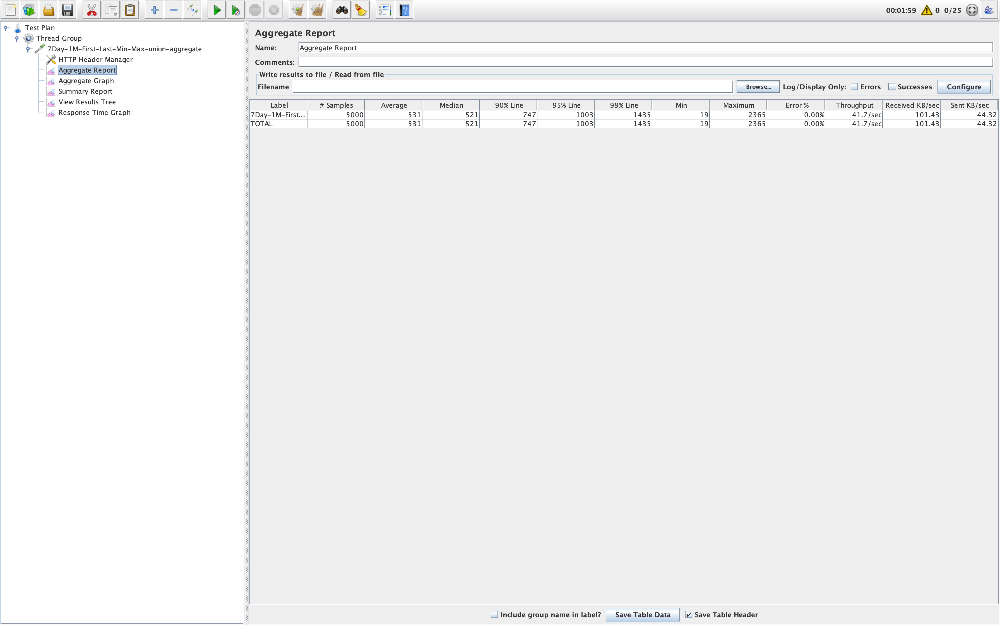

## Period 24
``` flux  
from(bucket: "local")   
  |> range(start: -30d, stop: now())   
  |> filter(fn: (r) => r["_measurement"] == "ticks")   
  |> filter(fn: (r) => r["_field"] == "price")   
  |> filter(fn: (r) => r["product"] == "AGUX/USD")   
  |> window(period: 1h)   
  |> first()   
  |> yield(name: "first")  
```  
### 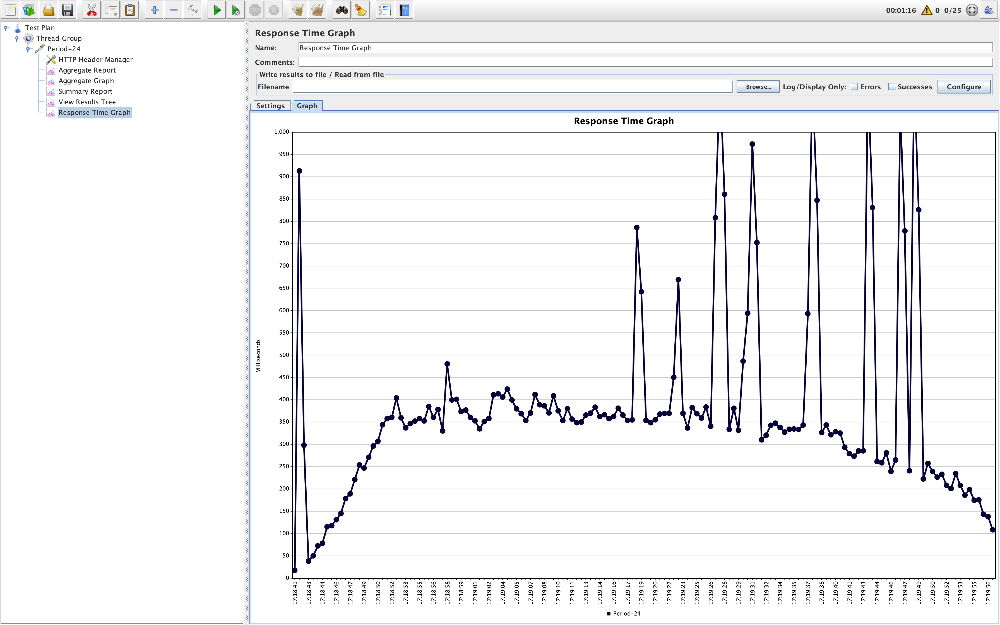

### 

## Period 168
```flux  
from(bucket: "local")   
  |> range(start: -37d, stop: now())   
  |> filter(fn: (r) => r["_measurement"] == "ticks")   
  |> filter(fn: (r) => r["_field"] == "price")   
  |> filter(fn: (r) => r["product"] == "AGUX/USD")   
  |> window(period: 1h)   
  |> first()   
  |> yield(name: "first")  
```  

### 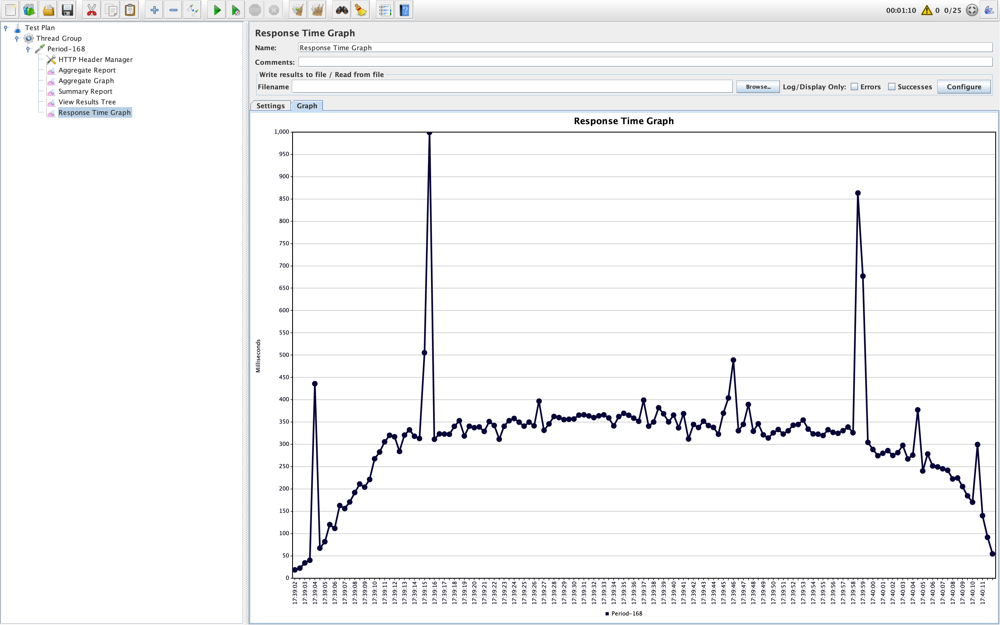

### 

## Yearly Min Max
Yearly Min and Max will perform very poor when executed on whole dataset using *union*.
The performance is better when executed without union, even better when used on aggregates with union.
1. On whole dataset without union
```flux  
 from(bucket: "local") 
   |> range(start: -1y) 
   |> filter(fn: (r) => r["_measurement"] == "ticks") 
   |> filter(fn: (r) => r["_field"] == "price") 
   |> filter(fn: (r) => r["product"] == "AGUX/USD") 
   |> aggregateWindow(every: 1y, fn: max, createEmpty: false) 
   |> yield(name: "max") 
from(bucket: "local") 
   |> range(start: -1y) 
   |> filter(fn: (r) => r["_measurement"] == "ticks") 
   |> filter(fn: (r) => r["_field"] == "price") 
   |> filter(fn: (r) => r["product"] == "AGUX/USD") 
   |> aggregateWindow(every: 1y, fn: min, createEmpty: false) 
   |> yield(name: "min")
```
### 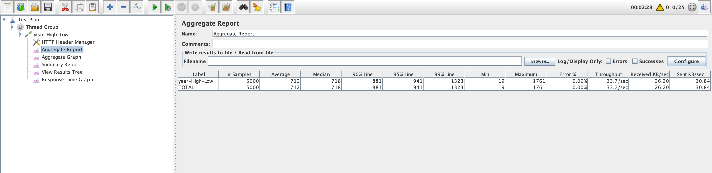

### 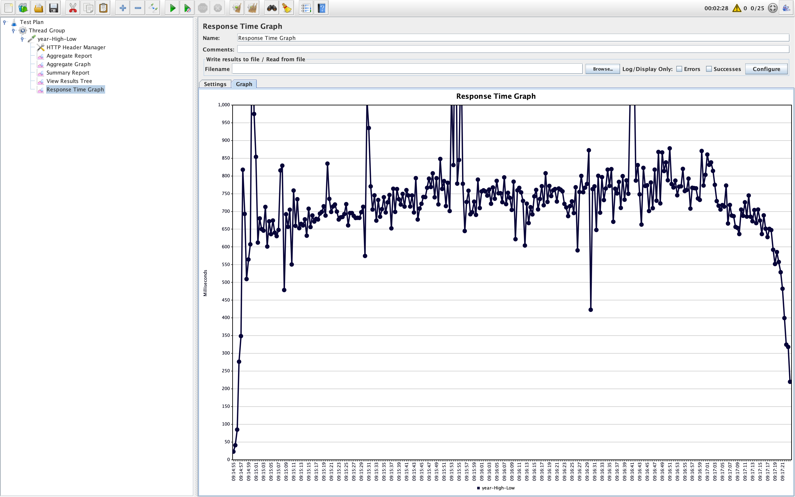
2. On Aggregate DataSet
``` flux
data = from(bucket: "daily-aggregate") 
  |> range(start: -1y) 
  |> filter(fn: (r) => r["_measurement"] == "ticks") 
  |> filter(fn: (r) => r["product"] == "AGUX/USD") 
  |> window(every: 1y) 
max = data 
  |> filter(fn: (r) => r["_field"] == "max") 
  |> max() 
  |> set(key: "type", value: "max" ) 
min = data 
  |> filter(fn: (r) => r["_field"] == "min") 
  |> min() 
  |> set(key: "type", value: "min" ) 
union(tables: [min, max]) 
  |> group(columns:["type"], mode: "by") 
  |> yield()
```
### 

### 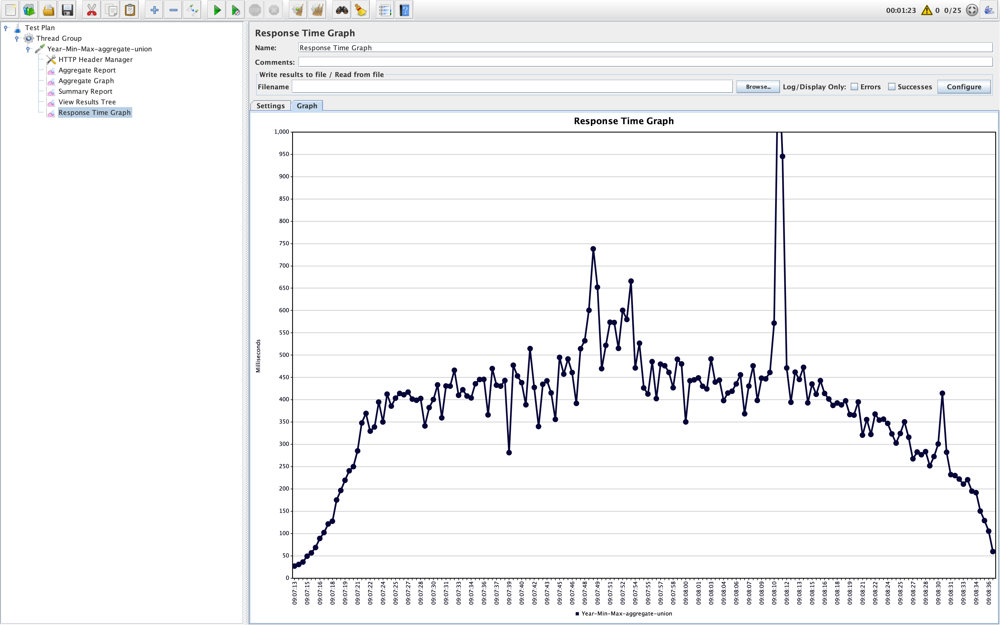

# Influx Cloud benchmarks (paid version)

| Query                            |  Influx Cloud |
|----------------------------------|---------------|
| customize-7day-1month.sql        |776            |
| day-high-low.sql (without union) |162            |
| day-high-low.sql (with union)    |158            |
| year-high-low.sql                |               |
| period1.sql                      |               |
| period24.sql                     |               |
| period168.sql                    |               |
| period744.sql                    |               |
| period8760.sql                   |               |


### Few Challenges or learnings while exploring influxDB

#### The space it takes for data store is less compared to other databases.
https://medium.com/dataseries/analysis-of-the-storage-mechanism-in-influxdb-b84d686f3697
https://docs.influxdata.com/influxdb/v1.8/concepts/storage_engine/

#### Continous Query is not automatic
The continous query doesn't actually updates when new data arrives. We have to set time period/cron job to get latest dataset. In addition to this I faced few issues if there are multiple tasks and runs for every minute like hourly, daily, weekly, monthly aggregates as continous tasks and runs for every minute. The docker instance went down, this is duw to system limitations and memory I set for docker. For higher configuration systems this shouldn't be a problem I believe.
We can use `Kapacitor` as a continous query engine to solve this issue but need to explore that option.
https://docs.influxdata.com/kapacitor/v1.5/guides/continuous_queries/

#### Performance of Queries when more aggregations are used
The performance of query even on large dataset is pretty good if we have only one or two aggregations. If there are more the performance gradually comes down. To mitigate this we can use reduce(), union() functions to solve this issues.
Some of the key performance considerions are listed in this page. https://docs.influxdata.com/influxdb/cloud/query-data/optimize-queries/

#### Custom flux functions
We can write custom flux functions as per our requirements. This helps in simplifying aggregations for specific use case. I have seen a very good video on custom flux queries and explained here. Our repo also had custom function by name `candles`.
https://www.youtube.com/watch?v=h6KYk17FBNk

#### Performance issues for high cardinal data. We don't have issues with it as we don't have high cardinal data.
#### Db migration has some effort no readily available tools. Though it is for one time. Shouldn't be an issue.
#### The newer version of influxDB 2.x needs lot of learning though there is fair amount of docs available

### Influx is available in different components
Influx is available as standalone (community), cloud and enterprise. With the analsis so far and performance benchmarks I feel that `influx cloud version` is enough for the current data store and projected one. But we need to consider if they provide the hosted version on our cloud, the call we have to take after getting in touch with influx team, They had SAAS service AWS, Azure and GCP.  Enterprise is something that is open for debate.

### Few Important Links
https://dganais.medium.com/now-that-youve-read-through-top-5-hurdles-for-flux-beginners-and-resources-for-learning-to-use-b3de4b6a9e35
https://docs.influxdata.com/influxdb/cloud/query-data/optimize-queries/
https://docs.influxdata.com/kapacitor/v1.5/guides/continuous_queries/
https://devops.com/how-to-pivot-and-join-time-series-data-in-flux/
https://www.slideshare.net/influxdata/anais-dotisgeorgiou-faith-chikwekwe-influxdata-top-10-hurdles-for-flux-beginners-influxdays-virtual-experience-na-2020-239121585
https://blog.devgenius.io/3-years-of-influxdb-with-aggregation-a-review-6d160a4281cf
http://wiki.webperfect.ch/index.php?title=InfluxDB:_Flux_-_Multiple_aggregations_(min,_max,_avg)
https://www.influxdata.com/blog/tldr-influxdb-tech-tips-aggregating-across-tags-or-fields-and-ungrouping/
